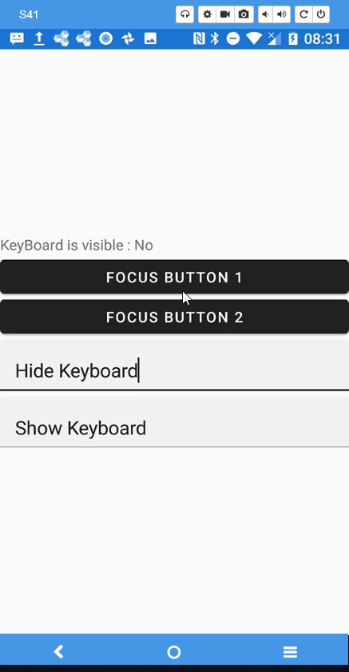
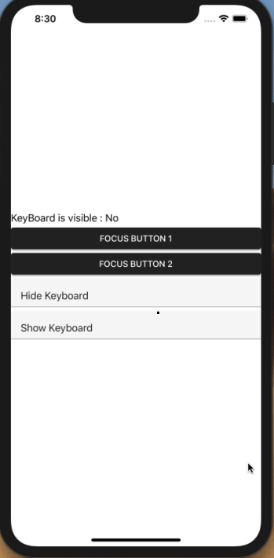

# Xamarin.KeyboardHelper

This plugin includes:
- Xamarin.EnableKeyboardEffect -- allows user to show/hide softkeyboard on Android/iOS platform in Xamarin.Forms
- SoftKeyboardService -- check entry's IsAcceptingText status

# Building Status


# Setup

- Need Xamarin.Forms version 3 or above
- `Xamarin.EnableKeyboardEffect` Available on NuGet: https://www.nuget.org/packages/Xamarin.EnableKeyboardEffect
- Install into your platform-specific projects (iOS/Android), and any .NET Standard 2.0 projects required for your app.
- Add ```
        xmlns:effects="clr-namespace:Xamarin.EnableKeyboardEffect;assembly=Xamarin.EnableKeyboardEffect"  ```at the top of the xaml file 
  
## Platform Support

|Platform|Supported|Version|Notes|
| ------------------- | :-----------: | :------------------: | :------------------: |
|Xamarin.iOS|Yes|iOS 8+| |
|Xamarin.Android|Yes|API 16+|Project should [target Android framework 9.0+](https://docs.microsoft.com/en-us/xamarin/android/app-fundamentals/android-api-levels?tabs=vswin#framework)|    

## For Android

```csharp
        protected override void OnCreate(Bundle savedInstanceState)
        {
            base.OnCreate(savedInstanceState);
            global::Xamarin.Forms.Forms.Init(this, savedInstanceState);
            
            //need this line to init effect in android
            Xamarin.EnableKeyboardEffect.Platform.Droid.Effects.Init(this);
            
            LoadApplication(new App());
        }
```

## For iOS

```csharp
        public override bool FinishedLaunching(UIApplication app, NSDictionary options)
        {
            global::Xamarin.Forms.Forms.Init();
            
            //need this line to init effect in iOS
            Xamarin.EnableKeyboardEffect.Platform.iOS.Effects.Init();
            
            LoadApplication(new App());
            return base.FinishedLaunching(app, options);
        }
```

# Usage

### Show soft keyboard

```csharp
        <Entry Text="Show Keyboard" effects:EnableKeyboardEffect.EnableKeyboard="True">
            <Entry.Effects>
                <effects:KeyboardEnableEffect/>
            </Entry.Effects>
        </Entry>
```

### Hide soft keyboard

```csharp
        <Entry Text="Hide Keyboard" effects:EnableKeyboardEffect.EnableKeyboard="False">
            <Entry.Effects>
                <effects:KeyboardEnableEffect/>
            </Entry.Effects>
        </Entry>
```

### Bind boolean property to effect

```csharp
        <Entry Text="Toggle Keyboard" effects:EnableKeyboardEffect.EnableKeyboard="{Binding BooleanBinding}">
            <Entry.Effects>
                <effects:KeyboardEnableEffect/>
            </Entry.Effects>
        </Entry>
```

# Demo

### Android



### iOS



# Limitations

Only support Android and iOS for the moment. 

Android note: Entry that get focused by calling .Focus() method may still cause keyboard not hiding properly.

# Contributing

Contributions are welcome.  Feel free to file issues and pull requests on the repo and they'll be reviewed as time permits.

# License
Under MIT, see LICENSE file.
